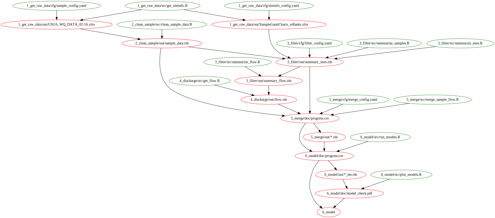

# MMSD_trends

## Setup

Configuration to use `make` with this R project may involve these steps:

1. Ensure that the current version of Rscript is available on your bash PATH. A good place to do this is the .bash_profile file in your HOME directory, where HOME is whatever bash, not RStudio, believes it to be (type `echo $HOME` or `echo ~` in bash to find out). This file+line may have been added for you when you installed Git.
    ```
    ### HOME/.bash_profile ###
    export PATH=$PATH:/c/Program\ Files/R/R-3.4.1/bin/x64:/c/Program\ Files/R/R-3.4.1/bin/x64:/c/Program\ Files/R/R-3.4.1/bin/x64
    ```

2. Especially on Windows, you may find that your `R_USER` environment variable is different between the RStudio console and a bash R session, even if you open bash from RStudio. The common pattern is that RStudio calls your Documents directory home, while bash calls your Documents/.. directory home. This is inconvenient for automatically loading profile information as found in .Rprofile, etc., so to resolve this, (a) create two .Rprofiles, one in each possible home. One of them should contain all important R calls, while the other one should simply source the first, and (b) in the important .Rprofile, define the R_USER variable to be the one containing your user R library (e.g., R/xxx-library/3.4).
    ```
    ### RStudio-R_USER/.Rprofile (the important one) ####
    # set R_USER
    Sys.setenv(R_USER="C:/Users/yourusername/Documents")
    ```
    
    ```
    ### bash-R_USER/.Rprofile (the redirect one) ####
    source('~/Documents/.Rprofile')
    ```

3. For bash to recognize your user R library, you may need to explicitly add it to `.libPaths()`, as follows. We first set the value of `$R_USER` (see above) and then use that value to set the path:

    ```
    ### RStudio-R_USER/.Rprofile (adding lines to the above) ####
    # set R library paths
    version_maj_min <- paste(unclass(getRversion())[[1]][1:2], collapse='.')
    .libPaths(c(file.path(Sys.getenv("R_USER"), "R/win-library", version_maj_min),
                file.path(Sys.getenv('R_HOME'), "library")))
    ```

4. If there are credentials involved, our team will likely be using the `dssecrets` package. This is a private package, so to install from GitHub, it will be useful to specify a [GitHub Personal Access Token](https://github.com/settings/tokens) (`GITHUB_PAT`) in your environment variables. It may also be necessary to tell `secret` exactly where to look for your private key (`USER_KEY`) that matches your public key in `dssecrets`. You can specify both variables in the same place: the same .Rprofile file mentioned twice above.
    ```
    ### RStudio-R_USER/.Rprofile (adding still more lines) ####
    # Set additional environment variables
    Sys.setenv(
      GITHUB_PAT='yourgithubpat',
      USER_KEY="C:/Users/yourusername/.ssh/id_rsa_orsimilar")
    ```


## Building the project

Build this project, or pieces of it, using `make`. You can do this either in RStudio using (Ctrl/Cmd)+Shift+B, or in bash (use Alt,t,s to open a bash window). The basic shell command is `make -f [makefile.mak]` where the specific makefile you want depends on which phase or target you want to build.

### Building from bash

The following are examples of complete commands to be typed in the bash shell:

To build the entire project, build the main Makefile. Because 'Makefile' is the default filename for `make`, all you need to type is the program name:
```
make
```

To build the third phase and any of its dependencies:
```
make -f build/3_filter.mak
```

To build just the summary_sites.rds target of phase 3:
```
make -f build/3_filter.mak 3_filter/out/summary_sites.rds
```

To see what which commands are due to be run, without actually running them (for phase 3 in this example):
```
make -f build/3_filter.mak -n
```

### Building from RStudio

If you want to build from RStudio, configure your Build options (Build Tab | More | Configure Build Tools). In the "Additional arguments" box, type everything in the command except the first word, `make `. The "Additional arguments" that correspond to the preceding four examples are:
```
[blank]
```
```
-f build/3_filter.mak
```
```
-f build/3_filter.mak 3_filter/out/summary_sites.rds
```
```
-f build/3_filter.mak -n
```
Pick one of these lines to enter in "Additional arguments" and you'll be able to run that line with just the (Ctrl/Cmd)+Shift+B shortcut.

### What happens in a build

Subfolders named 'out' and 'log' exist within each numbered folder, and there are a few 'doc' subfolders here and there. On GitHub, these are empty except for README.md files. The README.md files serve as placeholders so that the directories can be versioned and don't need to be created by the project scripts. When you build the project, these folders become populated with data files, figures, etc. ('out'), R session logfiles ('log'), and ancillary documentation ('doc'). 


## R scripts

What's going on?

### 1_get_raw_data

Raw data files are saved on a private S3 bucket. The function in this step assumes you have a "default" credential set up on your computer. Then, the files are simply downloaded to the "1_get_raw_data/out" folder.

### 2_clean_sample

This step opens the raw data, converts the data to numbers + remarks (because the data is coming in like "< 0.5" for example).

### 3_filter

This step associates the MMSD sites with USGS gages, and filters out sites that don't have enough data. 

TODO: some sites on the raw data Excel file don't have USGS flow sites properly assigned. When we update that file, we'll want to only get new data.

### 4_discharge

This step gets the discharge data using `dataRetrieval`. 

TODO: only get new data!

### 5_merge

This step merges the water-quality data with the flow data and makes `EGRET`'s "eList" objects. A "master_list" csv is saved at every step to watch the progress. Also, a pdf of the data is create to check how it all looks.

TODO: make smarter using that list.

### 6_model

This step runs a simple `lm` model on the data. It also outputs a progress.csv file. A pdf of all the model output in basic `lm` plots is output.

### Dependency tree



The procedure for making a make dependency diagram could surely be simplified...I started at a Software Carpentry [instructor' sguide](http://swcarpentry.github.io/swc-releases/2016.06/make-novice/extras/guide.html), downloaded a Scientific Linux virutal machine at (osboxes.org)[http://www.osboxes.org/scientific-linux/#scientific-linux-7-3-vmware], opened the virtual machine with Oracle VirtualBox, installed graphviz & git & gcc, built makefile2graph according to the SW Carpentry instructions, and created the .dot file there like so:

```
make -f build/6_model.mak -Bnd | make2graph > make_diagram.dot
```

And because I have yet to get Guest Additions working on that box, I uploaded the make_diagram.dot to Google Drive and downloaded onto my host computer. Then I installed the 'DOT' R package and ran

```r
dot(paste(grep('build', readLines('build/make_diagram.dot'), invert=TRUE, value=TRUE), collapse=' '), file='build/make_diagram.svg')
```

Clearly lots of room for improvement here:

- being able to build the .dot file without a virtual machine
- being able to build the .dot file a version of the directory that has all the cached files would be great
- something prettier (not seeing many examples on the web for Makefiles, though)

...but hey, it's a diagram!


## Disclaimer

This software is in the public domain because it contains materials that originally came from the U.S. Geological Survey (USGS), an agency of the United States Department of Interior. For more information, see the official USGS copyright policy at <https://www.usgs.gov/visual-id/credit_usgs.html#copyright>

Although this software program has been used by the USGS, no warranty, expressed or implied, is made by the USGS or the U.S. Government as to the accuracy and functioning of the program and related program material nor shall the fact of distribution constitute any such warranty, and no responsibility is assumed by the USGS in connection therewith.

This software is provided "AS IS."

[](http://creativecommons.org/publicdomain/zero/1.0/)
