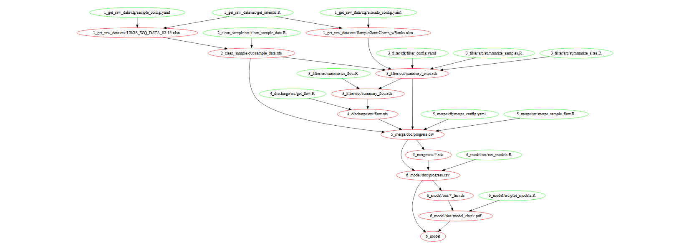

# MMSD_trends

## About this workflow

This project uses [GNU `make`](https://www.gnu.org/software/make), a file dependency manager that ensures that our analysis scripts get run in a sensible order. `make` defines a formal structure for declaring the required scripts and input files ('dependencies') for building each output file, and `make` uses that structure to build the entire project or specific files within the project when you ask. `make` is great for complex projects because it is economical: it _only_ runs those scripts that are stricly necessary to update a given output file, and it _only_ regenerates an output file if the file's dependencies have changed. This economy means that you can focus on single analysis task at a time, rarely wait for your computer to redo preceding tasks, and yet remain confident that your project is fully reproducible from raw data to final report. `make` has been widely used in software development for [decades](https://en.wikipedia.org/wiki/Make_(software)) and continues to be well maintained and documented. Its use in data analysis projects is less common, but equally useful -- we think you'll like it!

## Cache sharing rules

Together, `make` and `Git` do a remarkable job of enabling a shared cache of data files on a remote host such as Amazon S3 or a shared drive. Helpers in build/cache.mak and lib/src/s3.R support this workflow.

### The system:

Every data file (raw, intermediate, or final) is given a corresponding status indicator file, which shares the same name and location as the data file (usually `*/raw` or `*/out`) with an extra suffix: either `.s3` if the file is cached on Amazon S3 or `.loc` if the file is only stored locally. (If we were also storing some files on a shared Yeti or other drive, we'd also create and commit status files ending in `.yeti` or similar.) The status of a local repository is defined by the timestamps of these status files relative to their dependencies ('prerequisites' in `make`-speak).

These indicator files allow `make` to be economical about which data files need to be acquired to run the task you're working on. `make` targets should declare the status indicator files as dependencies; then, for every corresponding data file, the target recipe should call `make` for that file before launching into the main data analysis task for that target. This ensures that every build task has the files it needs at runtime, while not wasting time downloading or rebuilding data files that aren't essential to the task at hand. When they are needed, data files with `.s3` indicator files are downloaded from S3, while data files with `.loc` indicator files are built locally, using generic rules in build/cache.mak.

Our team-wide understanding of the status of the shared cache depends on these indicator files; therefore, indicator files are always Git committed. To keep the Git repository small, data files are never Git-committed.

Because the status information is represented by Git-managed files, there's no need to frequently check Amazon to see the latest file timestamps. Instead, when you update a file in the cache, others on the project continue working with their current (now outdated) copies of the data file until you Git-commit and they Git-pull the corresponding indicator file. Once they pull an updated indicator file, their next call to `make` will automatically update any updated files required to build their current `make` target.

The current system is generally efficient, especially if each developer wants to iterate on their step a few times before forcing others to use their updated data. However, if this system doesn't match the collaborative needs of a particular project, we could change things so that every cache update is noticed by every collaborator as soon as anybody tries to build anything. The cost of that second system is more frequent timestamp checks against the shared cache and more frequent, and sometimes unnecessary, data downloads.

### Best practices:

Everything is trivially easy if collaborators work in serial - i.e., Laura works on the project, edits, uploads, and commits as necessary, then logs off; then David comes in, git pulls, and proceeds to edit, upload, and commit as necessary, then logs off; then Lindsay comes in, git pulls, etc. However, if collaborators are working in parallel, we need to take care to avoid letting the cache fall out of date. "Out of date" would mean that a cached data file wrongly appears to be newer than its prerequisites, such that nobody's computer would bother trying to update it. To avoid this situation:

* Communicate so that collaborators are each working on a different piece of the project. This is good practice for all projects and especially when there's a shared cache.

* When working on a specific build target (job), edit the src code files for that target and build the data file as often as you like, but skip the caching by setting `post: FALSE` in lib/cfg/s3_post.yaml. Just remember to cache once before you commit by temporarily setting `post: TRUE`. And then set `post: FALSE` again, because FALSE is the preferred default state of that file on the shared Git repository. (It would often be harmless to repeatedly post the file to S3 while working on a target, but that takes extra time and could occasionally cause others to have a newer version of that file than suggested by the indicator file on their machine, possibly creating more work or unnecessary surprises for them.)

* Only commit indicator files whose corresponding data file was directly affected by your work. If you build data files downstream of your current target (e.g., to preview the final product after your upstream changes), revert rather than committing the downstream indicator files.

* If you merge changes from someone else and there are conflicts with indicator files whose data you are actively working on, you need to force a rebuild of those data files, because `make` will incorrectly believe everything is up to date. One way to do this is to delete and remake the affected indicator file[s].

* If you merge changes from someone else and there are conflicts with indicator files whose data you are NOT actively working on, then (1) you probably could have communicated a little better, and (2) it's OK, just accept the most recent timestamp in each conflicted file, because this will more accurately reflect the state of the S3 cache.

If the cache does become out of date, despite our best efforts, it's not terrible as long as we notice the problem. At that point we simply need to delete the status indicator files for all files suspected to be out of date, then rebuild using `make`. There are features in `make` for still more delicate repair operations if necessary.

## Setup

Configuration to use `make` with this R project may involve these steps:

1. Ensure that the current version of Rscript is available on your bash PATH. A good place to do this is the .bash_profile file in your HOME directory, where HOME is whatever bash, not RStudio, believes it to be (type `echo $HOME` or `echo ~` in bash to find out). This file+line may have been added for you when you installed Git.
    ```
    ### HOME/.bash_profile ###
    export PATH=$PATH:/c/Program\ Files/R/R-3.4.1/bin/x64:/c/Program\ Files/R/R-3.4.1/bin/x64:/c/Program\ Files/R/R-3.4.1/bin/x64
    ```

2. Especially on Windows, you may find that your `R_USER` environment variable is different between the RStudio console and a bash R session, even if you open bash from RStudio. The common pattern is that RStudio calls your Documents directory home, while bash calls your Documents/.. directory home. This is inconvenient for automatically loading profile information as found in .Rprofile, etc., so to resolve this, (a) create two .Rprofiles, one in each possible home. One of them should contain all important R calls, while the other one should simply source the first, and (b) in the important .Rprofile, define the R_USER variable to be the one containing your user R library (e.g., R/xxx-library/3.4).

    The first file to edit (or create) is called .Rprofile and lives in the directory path returned when you run `Sys.getenv("R_USER")` in the RStudio console.
    
    ```
    ### RStudio-R_USER/.Rprofile (the important one) ####
    # set R_USER
    Sys.setenv(R_USER="C:/Users/yourusername/Documents")
    ```
    
    The second file to edit (or create) is also called .Rprofile, but it lives in the directory path returned when you run `Sys.getenv("R_USER")` from an R session in bash: enter `R` at the bash prompt to open an R session and an R prompt, then type `Sys.getenv("R_USER")` at that R prompt.
    ```
    ### bash-R_USER/.Rprofile (the redirect one) ####
    source('~/Documents/.Rprofile')
    ```

3. For bash to recognize your user R library, you may need to explicitly add it to `.libPaths()`, as follows. We first set the value of `$R_USER` (see above) and then use that value to set the path:

    ```
    ### RStudio-R_USER/.Rprofile (adding lines to the above) ####
    # set R library paths
    version_maj_min <- paste(unclass(getRversion())[[1]][1:2], collapse='.')
    .libPaths(c(file.path(Sys.getenv("R_USER"), "R/win-library", version_maj_min),
                file.path(Sys.getenv('R_HOME'), "library")))
    ```

4. If there are credentials involved, our team will likely be using the `dssecrets` package. This is a private package, so to install from GitHub, it will be useful to specify a [GitHub Personal Access Token](https://github.com/settings/tokens) (`GITHUB_PAT`) in your environment variables. It may also be necessary to tell `secret` exactly where to look for your private key (`USER_KEY`) that matches your public key in `dssecrets`. You can specify both variables in the same place: the same .Rprofile file mentioned twice above.
    ```
    ### RStudio-R_USER/.Rprofile (adding still more lines) ####
    # Set additional environment variables
    Sys.setenv(
      GITHUB_PAT='yourgithubpat',
      USER_KEY="C:/Users/yourusername/.ssh/id_rsa_orsimilar")
    ```


## Building the project

Build this project, or pieces of it, using `make`. You can do this either in RStudio using (Ctrl/Cmd)+Shift+B, or in bash (use Alt,t,s to open a bash window). The basic shell command is `make -f [makefile.mak]` where the specific makefile you want depends on which phase or target you want to build.

### Building from bash

The following are examples of complete commands to be typed in the bash shell:

To build the entire project, build the main Makefile. Because 'Makefile' is the default filename for `make`, all you need to type is the program name:
```
make
```

To build the third phase and any of its dependencies:
```
make -f build/3_filter.mak
```

To build just the summary_sites.rds target of phase 3:
```
make -f build/3_filter.mak 3_filter/out/summary_sites.rds
```

To see what which commands are due to be run, without actually running them (for phase 3 in this example):
```
make -f build/3_filter.mak -n
```

### Building from RStudio

If you want to build from RStudio, configure your Build options (Build Tab | More | Configure Build Tools). In the "Additional arguments" box, type everything in the command except the first word, `make `. The "Additional arguments" that correspond to the preceding four examples are:
```
[blank]
```
```
-f build/3_filter.mak
```
```
-f build/3_filter.mak 3_filter/out/summary_sites.rds
```
```
-f build/3_filter.mak -n
```
Pick one of these lines to enter in "Additional arguments" and you'll be able to run that line with just the (Ctrl/Cmd)+Shift+B shortcut.

### What happens in a build

Subfolders named 'out' and 'log' exist within each numbered folder, and there are a few 'doc' subfolders here and there. On GitHub, these are empty except for README.md files. The README.md files serve as placeholders so that the directories can be versioned and don't need to be created by the project scripts. When you build the project, these folders become populated with data files, figures, etc. ('out'), R session logfiles ('log'), and ancillary documentation ('doc'). 


## R scripts

What's going on?

### 1_get_raw_data

Raw data files are saved on a private S3 bucket. The function in this step assumes you have a "default" credential set up on your computer. Then, the files are simply downloaded to the "1_get_raw_data/out" folder.

### 2_clean_sample

This step opens the raw data, converts the data to numbers + remarks (because the data is coming in like "< 0.5" for example).

### 3_filter

This step associates the MMSD sites with USGS gages, and filters out sites that don't have enough data. 

TODO: some sites on the raw data Excel file don't have USGS flow sites properly assigned. When we update that file, we'll want to only get new data.

### 4_discharge

This step gets the discharge data using `dataRetrieval`. 

TODO: only get new data!

### 5_merge

This step merges the water-quality data with the flow data and makes `EGRET`'s "eList" objects. A "master_list" csv is saved at every step to watch the progress. Also, a pdf of the data is create to check how it all looks.

TODO: make smarter using that list.

### 6_model

This step runs a simple `lm` model on the data. It also outputs a progress.csv file. A pdf of all the model output in basic `lm` plots is output.

### Dependency tree

[](build/make_diagram.svg)

The procedure for making a make dependency diagram could surely be simplified...I started at a Software Carpentry [instructor's guide](http://swcarpentry.github.io/swc-releases/2016.06/make-novice/extras/guide.html), downloaded a Scientific Linux virutal machine at [osboxes.org](http://www.osboxes.org/scientific-linux/#scientific-linux-7-3-vmware), opened the virtual machine with Oracle VirtualBox, installed graphviz & git & gcc, built makefile2graph according to the SW Carpentry instructions, and created the .dot file there like so:

```
make -f build/6_model.mak -Bnd | make2graph > make_diagram.dot
```

And because I have yet to get Guest Additions working on that box, I uploaded the make_diagram.dot to Google Drive and downloaded onto my host computer. Then I installed the 'DOT' R package and ran

```r
dot(paste(grep('build', readLines('build/make_diagram.dot'), invert=TRUE, value=TRUE), collapse=' '), file='build/make_diagram.svg')
```

Clearly lots of room for improvement here:

- being able to build the .dot file without a virtual machine
- being able to build the .dot file a version of the directory that has all the cached files would be great
- something prettier (mess with the colors or rendering of the .dot file, maybe)

...but hey, it's a diagram!


## Disclaimer

This software is in the public domain because it contains materials that originally came from the U.S. Geological Survey (USGS), an agency of the United States Department of Interior. For more information, see the official USGS copyright policy at <https://www.usgs.gov/visual-id/credit_usgs.html#copyright>

Although this software program has been used by the USGS, no warranty, expressed or implied, is made by the USGS or the U.S. Government as to the accuracy and functioning of the program and related program material nor shall the fact of distribution constitute any such warranty, and no responsibility is assumed by the USGS in connection therewith.

This software is provided "AS IS."

[](http://creativecommons.org/publicdomain/zero/1.0/)
