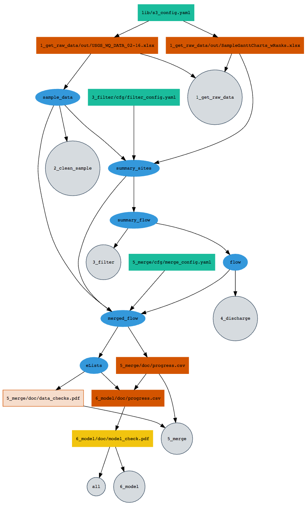

# MMSD_trends

## About this workflow

This project uses [`remake`](https://github.com/richfitz/remake), a file dependency manager that ensures that our analysis scripts get run in a sensible order. from richfitz:

You describe the beginning, intermediate and end points of your analysis, and how they flow together.

* "**targets**" are the points in your analysis.  They can be either files (data files for input; tables, plots, knitr reports for output) or they can be R objects (representing processed data, results, fitted models, etc).
* "**rules**" are how the targets in your analysis relate together and are simply the names of R functions.
* "**dependencies**" are the targets that need to already be made before a particular target can run (for example, a processed data set might depend on downloading a file; a plot might depend on a processed data set).

## Setup

Configuration to use `remake` with this R project is really simple!:

1. install `remake`:
```r
devtools::install_github("richfitz/remake")
```

2. install any missing packages that this project requires that you don't already have:
```r
remake::install_missing_packages()
```

3. If there are credentials involved, our team will likely be using the `dssecrets` package. This is a private package, so to install from GitHub, it will be useful to specify a [GitHub Personal Access Token](https://github.com/settings/tokens) (`GITHUB_PAT`) in your environment variables. It may also be necessary to tell `secret` exactly where to look for your private key (`USER_KEY`) that matches your public key in `dssecrets`. You can specify both variables in the same place: the same .Rprofile file mentioned twice above.
    ```
    ### RStudio-R_USER/.Rprofile (adding still more lines) ####
    # Set additional environment variables
    Sys.setenv(
      GITHUB_PAT='yourgithubpat',
      USER_KEY="C:/Users/yourusername/.ssh/id_rsa_orsimilar")
    ```


## Building the project

Build this project, or pieces of it, using `remake`. 
```r
library(remake)
# build the entire project:
make() 

# build only one stage of the project:
make(remake_file = "3_filter.yml")

# build only one target of the project:
make("5_merge/doc/progress.csv")
```

## debugging in R

`remake` is "unapologetically R focussed", and supports debugging of functions by inserting `browser()` commands inline to your functions


Want to do things the old fashioned way? you can create the script that `remake` would execute if all targets were out of date:
```r
remake::make_script()
 [1] "library(\"remake\")"
 [2] "library(\"EGRET\")"
 [3] "library(\"yaml\")"
 [4] "library(\"dplyr\")"
 [5] "library(\"dataRetrieval\")"
 [6] "library(\"readxl\")"
 [7] "library(\"tidyr\")"
 [8] "library(\"stringr\")"
 [9] "library(\"data.table\")"
[10] "library(\"aws.s3\")"
[11] "library(\"aws.signature\")"
[12] "source(\"6_model/src/run_models.R\")"
[13] "source(\"6_model/src/plot_models.R\")"
[14] "source(\"5_merge/src/merge_sample_flow.R\")"
[15] "source(\"4_discharge/src/get_flow.R\")"
[16] "source(\"3_filter/src/summarize_sites.R\")"
[17] "source(\"3_filter/src/summarize_samples.R\")"
[18] "source(\"3_filter/src/summarize_flow.R\")"
[19] "source(\"2_clean_sample/src/clean_sample_data.R\")"
[20] "source(\"lib/s3.R\")"
[21] "dir.create(\"6_model/doc\", FALSE, TRUE)"
[22] "dir.create(\"5_merge/doc\", FALSE, TRUE)"
[23] "dir.create(\"1_get_raw_data/out\", FALSE, TRUE)"
[24] "get_s3(\"1_get_raw_data/out/USGS_WQ_DATA_02-16.xlsx\", \"lib/s3_config.yaml\")"
[25] "sample_data <- clean_sample_data(\"1_get_raw_data/out/USGS_WQ_DATA_02-16.xlsx\")"
[26] "get_s3(\"1_get_raw_data/out/SampleGanttCharts_wRanks.xlsx\", \"lib/s3_config.yaml\")"
[27] "summary_sites <- summarize_sites(sample_data, \"1_get_raw_data/out/SampleGanttCharts_wRanks.xlsx\", \"3_filter/cfg/filter_config.yaml\")"
[28] "summary_flow <- summarize_flow(summary_sites)"
[29] "flow <- get_flow(summary_flow)"
[30] "merged_flow <- merge_sample_flow(\"5_merge/cfg/merge_config.yaml\", sample_data, summary_sites, flow)"
[31] "as.progress_csv(merged_flow, \"5_merge/doc/progress.csv\")"
[32] "eLists <- as.eLists(merged_flow)"
[33] "run_models(\"5_merge/doc/progress.csv\", eLists, \"6_model/doc/progress.csv\", \"6_model/out\")"
[34] "pdf(\"6_model/doc/model_check.pdf\")"
[35] "plot_models(\"6_model/doc/progress.csv\", \"6_model/doc/model_check.pdf\")"
[36] "dev.off()"

# or if you want to capture this in a script that you can source:
cat(remake::make_script(), file = 'MMSD_remake_script.R', sep = '\n')
```

## starting fresh
like `make`, you can start a "clean" build:
```r
remake::make("clean")
<  MAKE > clean
[ CLEAN ] tidy
[  READ ]                                                  |  # loading packages
(   DEL ) merged_flow                                      |  rm("merged_flow")
(   DEL ) eLists                                           |  rm("eLists")
(   DEL ) flow                                             |  rm("flow")
(   DEL ) summary_sites                                    |  rm("summary_sites")
(   DEL ) summary_flow                                     |  rm("summary_flow")
(   DEL ) sample_data                                      |  rm("sample_data")
[ CLEAN ] clean
(   DEL ) 6_model/doc/progress.csv                         |  file.remove("6_model/doc/progress.csv")
(   DEL ) 6_model/doc/model_check.pdf                      |  file.remove("6_model/doc/model_check.pdf")
(   DEL ) 5_merge/doc/progress.csv                         |  file.remove("5_merge/doc/progress.csv")
(   DEL ) 5_merge/doc/data_checks.pdf                      |  file.remove("5_merge/doc/data_checks.pdf")
(   DEL ) 1_get_raw_data/out/USGS_WQ_DATA_02-16.xlsx       |  file.remove("1_get_raw_data/out/USGS_WQ_DATA_02-16.xlsx")
(   DEL ) 1_get_raw_data/out/SampleGanttCharts_wRanks.xlsx |  file.remove("1_get_raw_data/out/SampleGanttCharts_wRanks.xlsx")
```
Note that the above command deletes files and also gets rid of R objects. 
Alternatively, you can delete individual targets:
```r
remake::delete("6_model/doc/progress.csv")
```

### What happens in a build

Subfolders named 'out' and 'log' exist within each numbered folder, and there are a few 'doc' subfolders here and there. On GitHub, these are empty except for README.md files. The README.md files serve as placeholders so that the directories can be versioned and don't need to be created by the project scripts. When you build the project, these folders become populated with data files, figures, etc. ('out'), and ancillary documentation ('doc'). 

## R scripts

What's going on?

### 1_get_raw_data

Raw data files are saved on a private S3 bucket. The function in this step assumes you have a "default" credential set up on your computer. Then, the files are simply downloaded to the "1_get_raw_data/out" folder.

### 2_clean_sample

This step opens the raw data, converts the data to numbers + remarks (because the data is coming in like "< 0.5" for example).

### 3_filter

This step associates the MMSD sites with USGS gages, and filters out sites that don't have enough data. 

TODO: some sites on the raw data Excel file don't have USGS flow sites properly assigned. When we update that file, we'll want to only get new data.

### 4_discharge

This step gets the discharge data using `dataRetrieval`. 

TODO: only get new data!

### 5_merge

This step merges the water-quality data with the flow data and makes `EGRET`'s "eList" objects. A "master_list" csv is saved at every step to watch the progress. Also, a pdf of the data is create to check how it all looks.

TODO: make smarter using that list.

### 6_model

This step runs a simple `lm` model on the data. It also outputs a progress.csv file. A pdf of all the model output in basic `lm` plots is output.

### Dependency tree

[

The procedure for making a remake dependency diagram:
```r
remake::diagram()
```
which also takes the same arguments as `remake::make()`, so you can build a diagram for a stage, the whole project, or a single target.

## Disclaimer

This software is in the public domain because it contains materials that originally came from the U.S. Geological Survey (USGS), an agency of the United States Department of Interior. For more information, see the official USGS copyright policy at <https://www.usgs.gov/visual-id/credit_usgs.html#copyright>

Although this software program has been used by the USGS, no warranty, expressed or implied, is made by the USGS or the U.S. Government as to the accuracy and functioning of the program and related program material nor shall the fact of distribution constitute any such warranty, and no responsibility is assumed by the USGS in connection therewith.

This software is provided "AS IS."

[](http://creativecommons.org/publicdomain/zero/1.0/)
